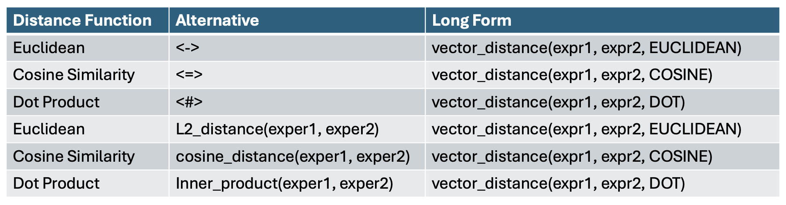

# Equivalent Distance Functions

Oracle AI Vector Search supports many different vector distance functions.



Here are some examples of using these desitance functions.

Create a table with some vectors

```SQL
CREATE TABLE flex4 (
  id NUMBER,
  embedding VECTOR
);
```
  
Insert some vectors

```SQL
INSERT INTO flex4 VALUES (1, '[1,2,3]');
INSERT INTO flex4 VALUES (2, '[4,5,6]');
INSERT INTO flex4 VALUES (3, '[7,8,9]');
INSERT INTO flex4 VALUES (4, '[7.1,5,6.3]');
INSERT INTO flex4 VALUES (5, '[9,7,8]');
```

Get the three nearest neighbors to a vector using Euclidean

```SQL
SELECT *
FROM flex4
ORDER BY embedding <-> VECTOR('[3,1,2]')
FETCH FIRST 3 ROWS ONLY;
```

Get the three nearest neighbors to a vector using Euclidean

```SQL
SELECT *
FROM flex4
ORDER BY L2_distance(embedding, VECTOR('[3,1,2]'))
FETCH FIRST 3 ROWS ONLY;
```

Get the three nearest neighbors to a vector using Euclidean

```SQL
SELECT *
FROM flex4
ORDER BY vector_distance(embedding, VECTOR('[3,1,2]'), EUCLIDEAN)
FETCH FIRST 3 ROWS ONLY;
```
```

Use the equivalent syntax to get rows within a certain distance

```SQL
SELECT * 
FROM flex4
WHERE VECTOR_DISTANCE(embedding, VECTOR('[3,1,2]'), EUCLIDEAN) < 5;
```
