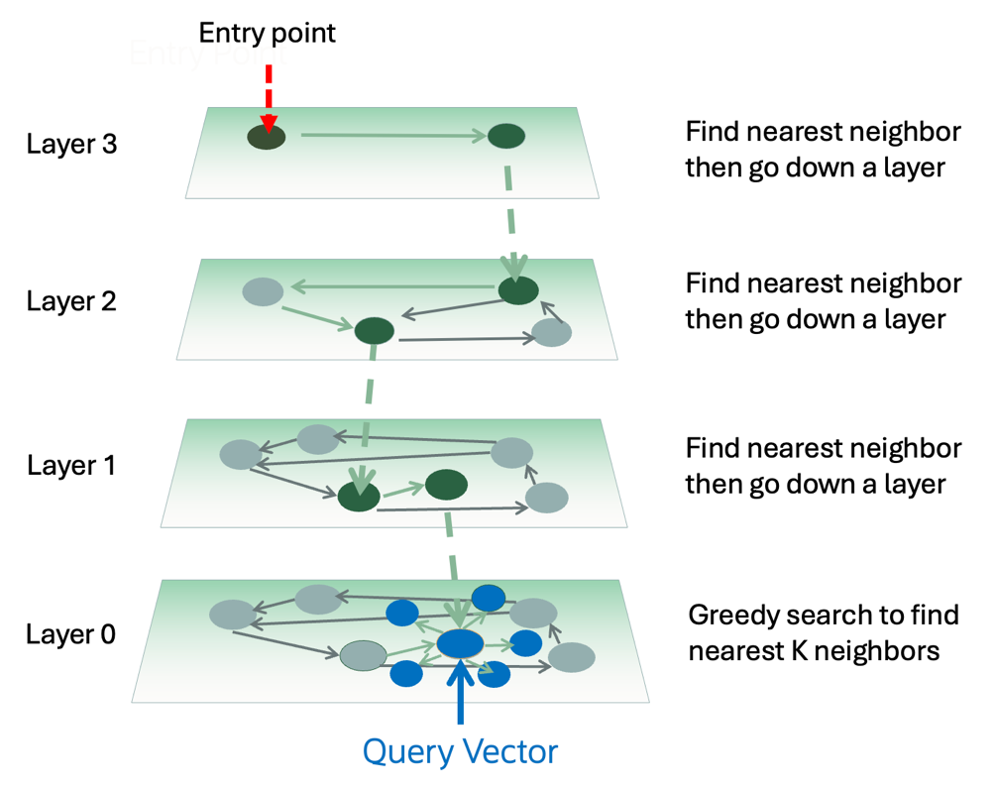

# HNSW Indexes

[Hierarchial Navigable Small World](https://docs.oracle.com/en/database/oracle/oracle-database/23/sqlrf/create-vector-index.html#GUID-B396C369-54BB-4098-A0DD-7C54B3A0D66F) (HNSW) are fast, memory based, proximity graph, vector indexes.

The HNSW vector indexes in **Oracle AI Vector Search** are called **InMemory Neighbor Graph** Indexes and are placed in a 
 multi-layer graph.   In each higher level of the graph there is a decaying fraction of vectors. At each layer the search finds the nearest neighbors of the search vector starting from a certain entry point and terminates with the nearest neighbors in the lowest level of the graph.



This type of index provides the fastest possible response time when all the data can fit within memory.  

HNSW vector indexes are faster than IVFFlat vector indexes, but they have two downsides:
- The entire HNSW vector index must fit with RAM
- They tend take longer to create than IVFFlat indexes

You must allocate sufficent memory for the [VECTOR_MEMORY_SIZE](../Installation/README.md#VECTOR_MEMORY_SIZE) parameter to be able to use the HNSW vector indexes.

## Some examples of creating HNSW vector indexes

```SQL
CREATE VECTOR INDEX flex3_embedding_hnsw ON flex3 (embedding)
ORGANIZATION INMEMORY NEIGHBOR GRAPH
WITH TARGET ACCURACY 90
DISTANCE COSINE
PARALLEL 4;
```

```SQL
DROP INDEX flex3_embedding_hnsw;
```

```SQL
CREATE VECTOR INDEX hnsw2 ON flex3 (embedding)
ORGANIZATION INMEMORY NEIGHBOR GRAPH
WITH TARGET ACCURACY 95
DISTANCE DOT
PARALLEL 16;
```

```SQL
DROP INDEX hnsw2;
```

```SQL
CREATE VECTOR INDEX hnsw3 ON flex3 (embedding)
ORGANIZATION INMEMORY NEIGHBOR GRAPH
WITH TARGET ACCURACY 80
DISTANCE EUCLIDEAN
PARALLEL 32;
```

```SQL
DROP INDEX hnsw3;
```

```SQL
CREATE VECTOR INDEX hnsw4 ON flex3 (embedding)
ORGANIZATION INMEMORY NEIGHBOR GRAPH
WITH TARGET ACCURACY 85
DISTANCE MANHATTAN
PARALLEL 64;
```

```SQL
DROP INDEX hnsw4;
```

```SQL
CREATE VECTOR INDEX hnsw5 ON flex3 (embedding)
ORGANIZATION INMEMORY NEIGHBOR GRAPH
WITH TARGET ACCURACY 80
DISTANCE HAMMING
PARALLEL 128;
```

```SQL
DROP INDEX hnsw5;
```

Comments on creating HNSW vector indexes:
- The VECTOR keyword is used to create vector indexes
  - Vector indexes are fundamentally different from existing indexes 
- The organization is INMEMORY NEIGHBOR GRAPH for HNSW vector indexes
  - The origanizations clause defines the type of graph  
- The WITH TARGET ACCURACY clause is used
  - This clauses defines the default accuracy for this vector index
  - eg 90 means that about 9/10 times, this will give the same resultset as if a exact query were used
- The distance function (COSINE) is defined
  - The vector embedding model defines the distance function used to train the neural network
  - Use the **same** vector distance function in the vector index to get the best results
- The vector index is created in parallel
  - Given sufficient available CPU cores, increasing the PARALLEL clause will tend to decrease the vector index creation time
