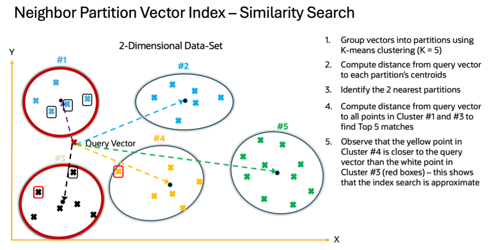

# IVFFlat Indexes

Oracle AI Vector Search supports IVFFlat vector indexes to enable huge vector indexes.  Unlike HNSW vector indexes which are limited in size by available RAM, IVFFlat vector indexes are limited in size by the available disk space.

Oracle AI Vector Search calls **IVFFlat** vector indexes **Neighbor Partition** indexes.
The Neighbor Partition Index is a table-based index whose partitions represent the clusters of vectors which are like each other.  

With this type of index, entries in the index are divided into partitions which correspond to centroids (or average) vectors which are representative of the data.  Searches of the index are performed by first determining the nearest centroids to a search vector and then by searching the partitions which correspond to each centroid.

As IVFFlat indexes use the Oracle Database buffer cache, there may be physical IOs during IVFFlat vector searches.  These physical (and logical) IOs tend to be slower than the using the in-memory HNSW vector indexes.

