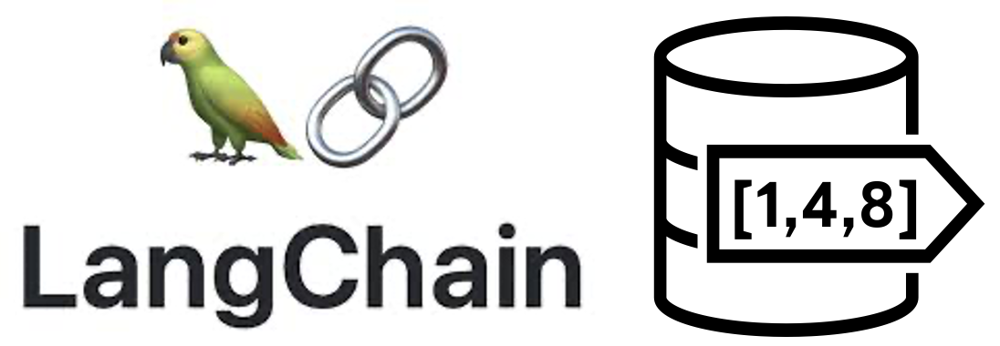

# LangChain Support for Oracle AI Vector Search

Oracle AI Vector Search supports LangChain.

Links to the official LangChain Githib Repo:
- [Cookbook - Oracle AI Vector Search with Document Processing](https://github.com/langchain-ai/langchain/blob/master/cookbook/oracleai_demo.ipynb)
- [Oracle Provider for LangChain](https://python.langchain.com/v0.1/docs/integrations/providers/oracleai/)
- [Oracle Embeddings](https://github.com/langchain-ai/langchain/blob/master/libs/community/langchain_community/embeddings/oracleai.py)
- [Oracle Document Loader](https://github.com/langchain-ai/langchain/blob/master/libs/community/langchain_community/document_loaders/oracleai.py)
- [Summary Utilities](https://github.com/langchain-ai/langchain/blob/master/libs/community/langchain_community/utilities/oracleai.py)
