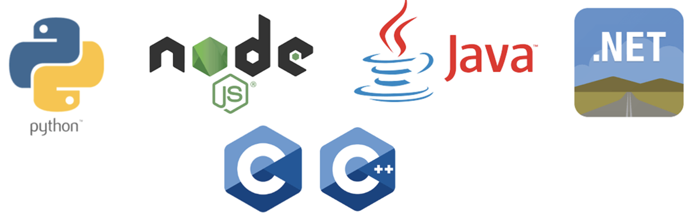

# Language Support in Oracle AI Vector Search

All Oracle SQL drivers which can use SQL or PLSQL can support vectors via the following:
- SQL functions
  - vector_embedding
  - vector_distance
  - to_vector
  - from_vector
- PLSQL packages
  - DBMS_VECTOR
  - DBMS_VECTOR_CHAIN
