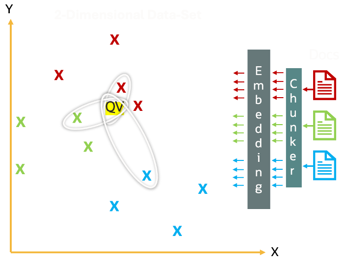

# Multi Vector in Oracle AI Vector Search

AI vector search SQL can also be performed with much more complex queries involving joins and groupings. It supports a search pattern known as **multi-vector** where a single entity is associated with multiple vectors. 

In the picture below, there are three documents, red, green and blue.  The three closest vectors to the yellow query vector are two red and one green vector.  If you want to get vectors from multiple documents, even if they are not the closest, then you can use the multi-vector syntax.  



For example, large documents (such as books) are typically divided into smaller chunks which are independently embedded into separate vectors. When searching for the most relevant books for a given search text fragment, the top 10 closest matching text chunks from the top 5 matching books can be generated from the following query: 

```SQL
SELECT b.name, b.author
FROM books b JOIN chunks c ON bookid
ORDER BY VECTOR_DISTANCE(c.chunk_vector, :search_vector, COSINE)
FETCH APPROXIMATE FIRST 5 PARTITIONS BY b.bookid, 10 ROWS ONLY;
```


